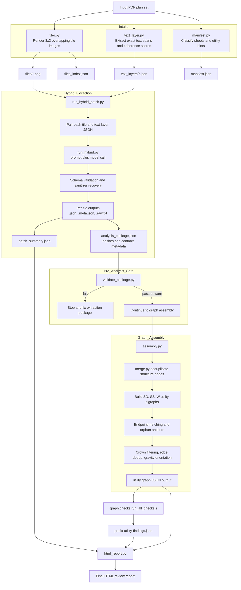
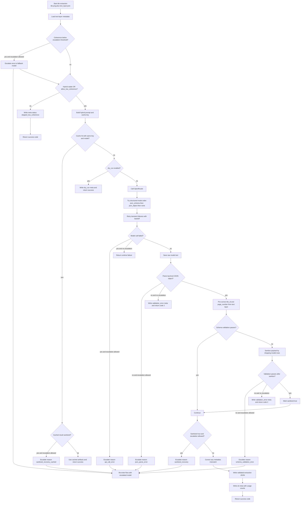

# Plan Reviewer Architecture Flows

These diagrams are designed to be readable by non-coders while still matching the real runtime code path.

## 1) End-to-end architecture

## 2) Extraction decision flow (zoomed in)

## Mental model with accurate analogies

- Intake is the scanning room:
  - `tiler.py` cuts each big sheet into readable pieces.
  - `text_layer.py` records every exact number and where it came from.
- Hybrid extraction is two reviewers in one seat:
  - vision reads layout and context,
  - text-layer data supplies exact numeric values.
- Package validation is shipping QA:
  - verifies files, hashes, and quality ratio before graph analysis.
- Graph assembly is converting notes into a network map:
  - structures become nodes and pipes become edges.
- Deterministic checks are engineering inspectors:
  - slope math, flow direction, connectivity, and elevation consistency.
- HTML report is the briefing packet:
  - findings table plus extracted schedules and quality warnings.

## How to view in editor

- Open this file in markdown preview to render both Mermaid diagrams.
- Raw diagram sources are also available as:
  - `docs/diagrams/app-architecture.mmd`
  - `docs/diagrams/extraction-decision-flow.mmd`
